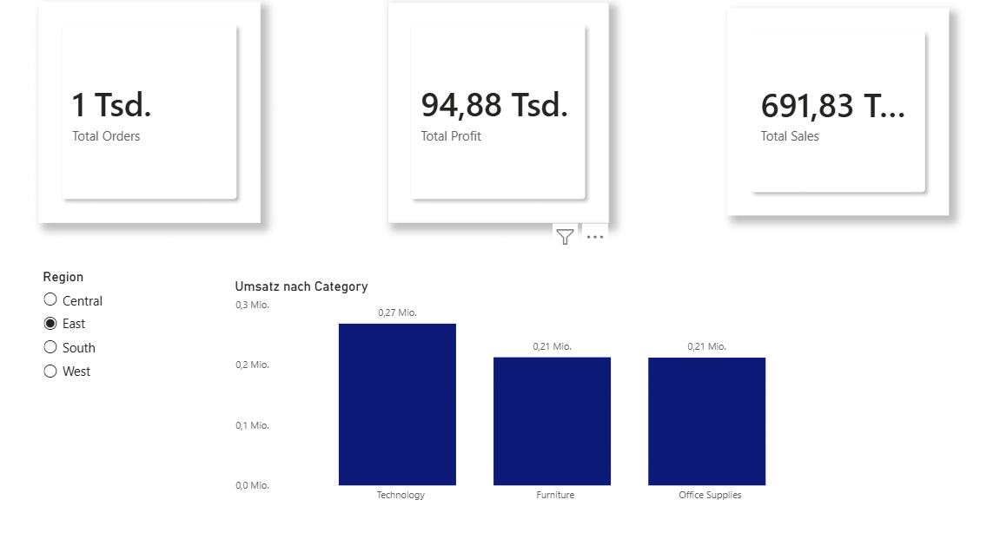
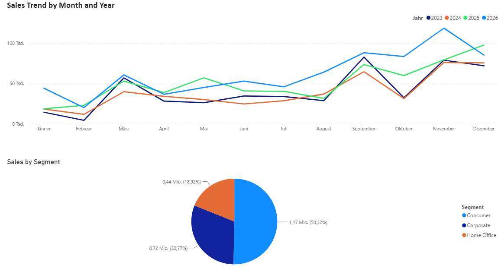
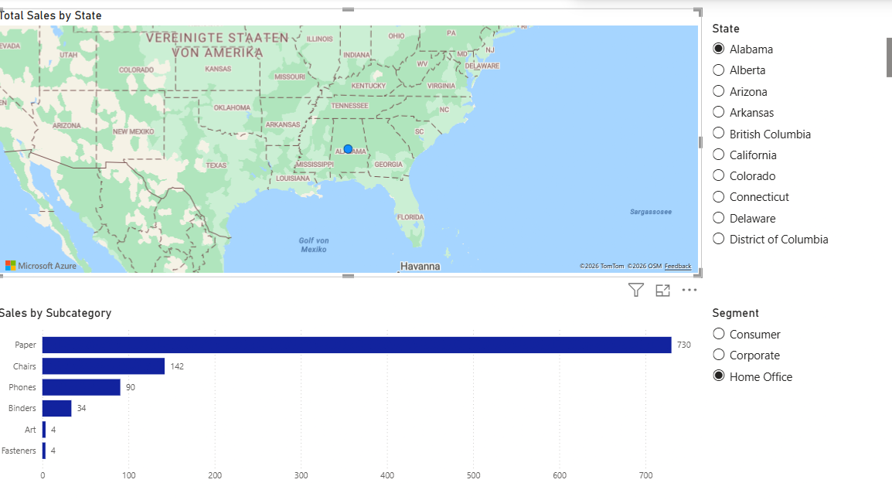
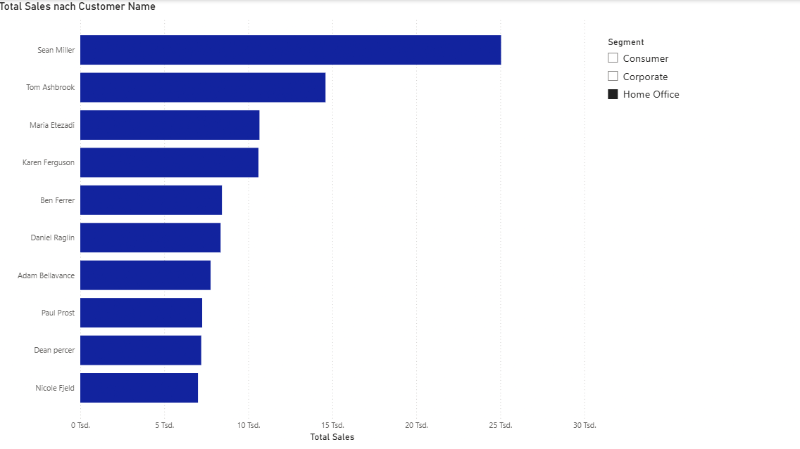
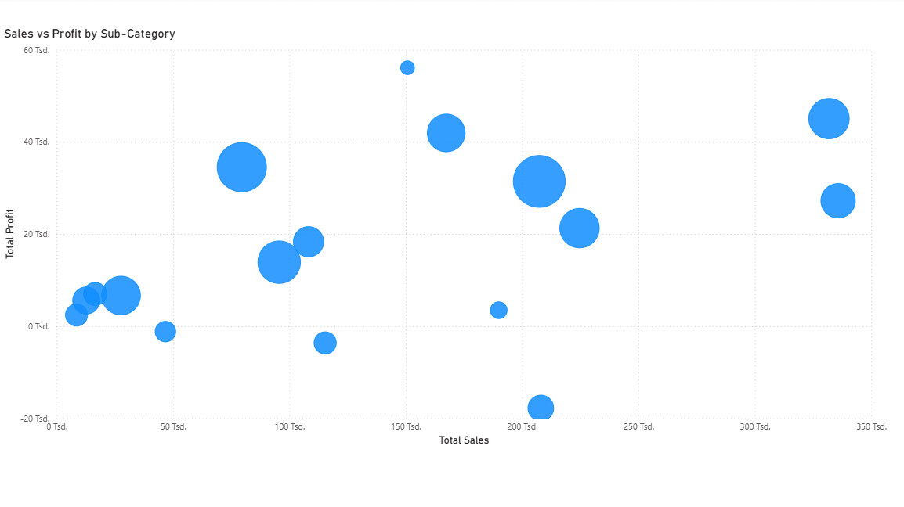
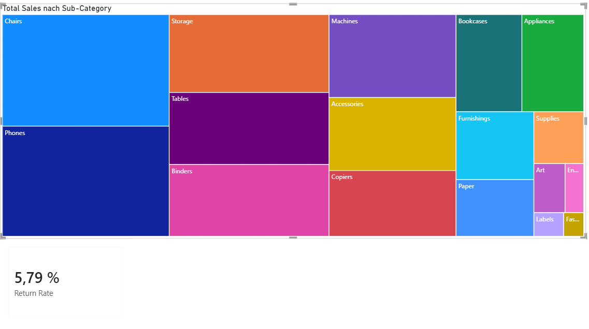

# 📊 Power BI Superstore Sales Dashboard

## 📌 Project Overview
This project presents an interactive sales dashboard built in Microsoft Power BI using the Superstore dataset. It provides insights into sales performance, profit, orders, customers, products, and regional trends through interactive visualizations.

## 🛠 Tools & Technologies
- Microsoft Power BI
- Power Query
- DAX
- Microsoft Excel (Superstore Dataset)

## 📈 Dashboard Features
- Sales Overview
- Profit Analysis
- Sales by Category
- Sales by State
- Top 10 Customers
- Sales vs Profit Analysis
- Interactive Filters and Slicers

## 📂 Files
- Superstore Dashboard.pbix – Power BI report
- sample_-_superstore.xls – Source dataset
- Page1.png – Dashboard Preview
- Page2.png
- Page3.png
- Page4.png
- Page5.png
- Page6.png

## 📷 Dashboard Preview

### Sales Overview

### Sales Analysis

### Map Analysis

### Top Customers

### Sales vs Profit Analysis

### Product Performance

(Add your dashboard screenshots here.)

## 📬 Contact
